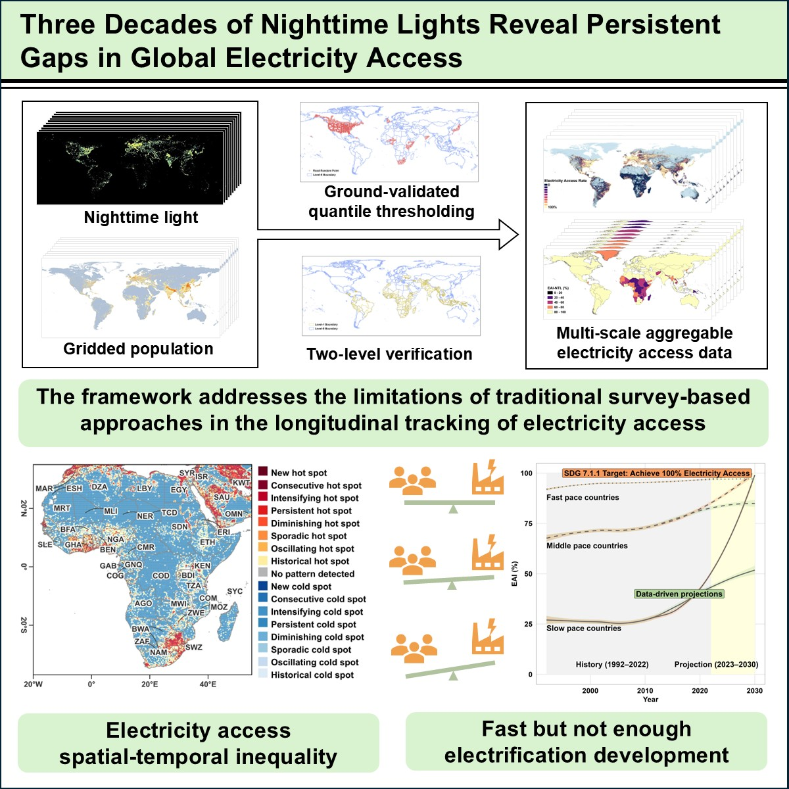

# EAI
Universal access to electricity remains a cornerstone of sustainable development, yet persistent gaps in monitoring and addressing disparities hinder progress. Over the past three decades, the lack of spatial-temporal consistent datasets has obscured nuanced trends in electrification, particularly in underserved regions. We introduce a framework integrating harmonized nighttime light observations with high-resolution population data to generate a globally consistent Electricity Access Indicator dataset. Our analysis reveals that while the unelectrified population has declined worldwide, regional disparities have intensified. High-income countries now exhibit near-saturation of electricity access, whereas many low-income regions—particularly in Sub-Saharan Africa and South Asia—continue to experience substantial access deficits. Bridging this gap by 2030 requires a 37.5-fold increase in the current growth rate for lagging regions. This study offers a 31-year (1992–2022) comprehensive benchmark for assessing global electricity access through a multidimensional perspective, providing essential insights for designing equitable and effective energy policies.

More details will be available after some necessary reviews and revisions.

## Dataset
Liu, L., & Cao, X. (2024). A long-term global population proportion with access to electricity dataset (SDG 7.1.1) from 1992 to 2022 based on nighttime light remote sensing (1.0) [Data set]. Zenodo. https://doi.org/10.5281/zenodo.14018079
